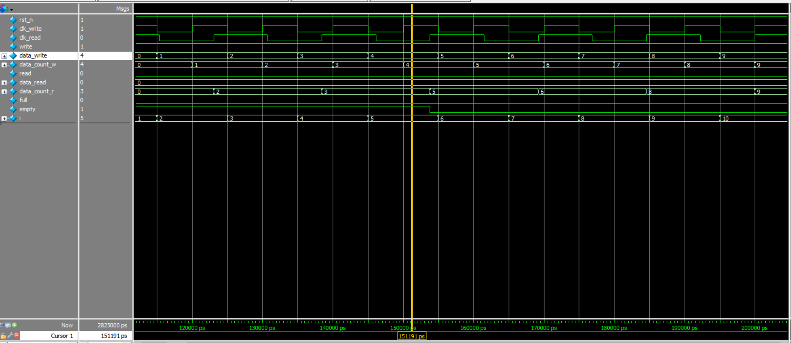
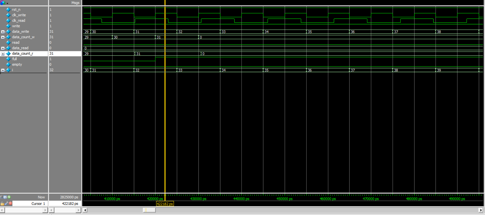
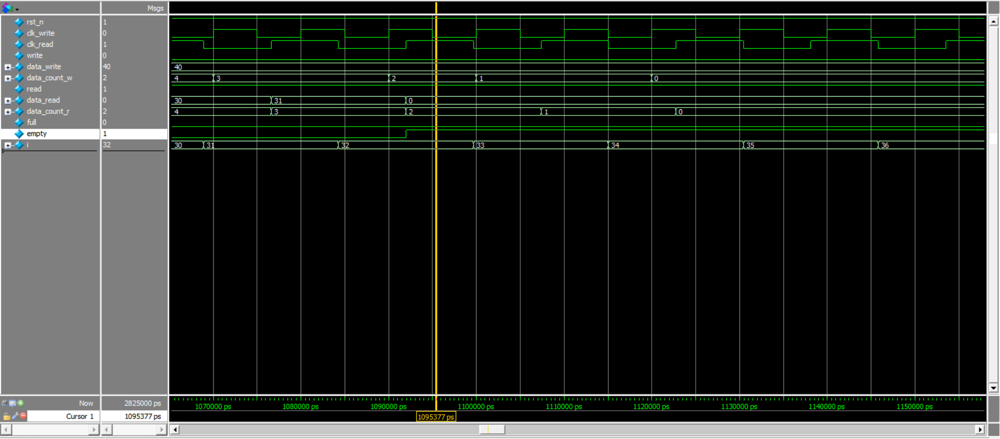

# Asynchronous_FIFO
# Design of Dual Clock Asynchronous FIFO
This project shows the design of Asynchronous FIFO

## Asynchronous FIFO

  In the realm of digital design and data processing, the Asynchronous First-In-First-Out (FIFO) plays a significant role in ensuring seamless and efficient data flow between different clock domains. The concept of an asynchronous FIFO stems from the need to manage data communication between different clock domains or systems that operate at varying frequencies. This essay delves into the world of asynchronous FIFOs, exploring their working principles, applications, advantages, and challenges.
The theory behind an asynchronous FIFO involves managing data transfer, addressing potential timing differences, and
ensuring data integrity. Here are the key concepts:

## Working Principles:
An asynchronous FIFO is a specialized memory structure that allows data to be stored and retrieved in the order it was received. Unlike synchronous FIFOs that rely on a common clock signal, asynchronous FIFOs operate using independent clock domains, making them suitable for interfacing systems with different clock frequencies or asynchronous signals. The key component of an asynchronous FIFO is its handshaking mechanism, which ensures proper data transfer and synchronization.

## Key Components and Operation:
An asynchronous FIFO typically comprises two main components: the Read Port and the Write Port. The Write Port receives incoming data from the source domain, buffering it and managing data storage. The Read Port retrieves data from the buffer and transfers it to the destination domain. The essential aspect of this process is the control circuitry that handles the handshake signals—Empty and Full flags—to manage data movement, ensuring that no data is lost or overwritten.

## Read and Write Pointers
The FIFO includes read and write pointers that keep track of the current position in memory. The
write pointer indicates the location where new data is stored, while the read pointer indicates the next data to be read.
## Data Transfer
When data is written to the FIFO, it is stored in a specific memory location determined by the write pointer.
Simultaneously, the write pointer is incremented to point to the next available memory location. Similarly, when data is read
from the FIFO, the read pointer identifies the data to be read, and the read pointer is incremented accordingly.
## Timing Considerations
Asynchronous FIFOs account for the potential timing differences between the source and
destination clock domains. This is achieved through techniques such as handshaking protocols, synchronization elements
(e.g., flip-flops), and control logic. These mechanisms ensure that data is transferred reliably and without loss, even when the
clocks are operating independently.
## Status Indicators
Asynchronous FIFOs often provide status indicators such as full and empty flags. These flags indicate
whether the FIFO is full (no more data can be written) or empty (no data is available for reading).
## Synchronization and Metastability
Asynchronous FIFOs employ synchronization elements to address metastability issues
that can occur when data crosses clock domains. These elements help ensure that the data is properly captured and sampled,
reducing the risk of unpredictable behavior.
Overall, the theory behind an asynchronous FIFO revolves around managing data transfer between different clock domains
while considering timing differences, ensuring data integrity, and providing status indications for proper operation. The
actual implementation of an asynchronous FIFO involves designing the circuitry and control logic based on these principles.

## Advantages:
The primary advantage of asynchronous FIFOs lies in their ability to handle data transfer between clock domains without the need for global synchronization. This leads to reduced latency and avoids the complexities associated with clock domain synchronization techniques. Asynchronous FIFOs offer flexibility by accommodating various clock frequencies, making them ideal for scenarios where timing differences exist.

## Conclusion:
Asynchronous FIFOs serve as essential building blocks in modern digital systems, enabling efficient and reliable data transfer between different clock domains. Their ability to handle data flow without the constraints of a common clock signal enhances system flexibility and performance. As technology advances and the demand for high-speed and heterogeneous systems grows, the significance of asynchronous FIFOs in maintaining coherent data exchange remains steadfast. Effective utilization and understanding of asynchronous FIFOs empower digital designers to conquer challenges related to data synchronization and flow, paving the way for innovative and robust system architectures.
## Results 

